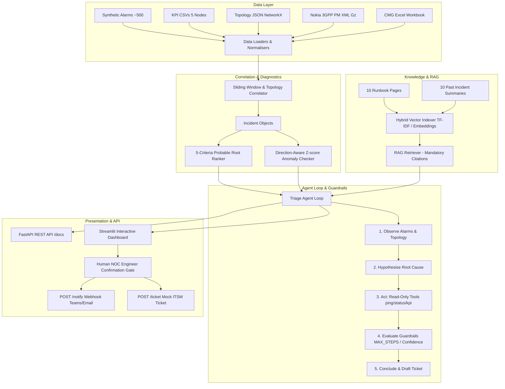

# Architecture & Design Overview: Network Triage Agent

## Key Architectural Principles
1. **Strict Read-Only Guarantee**: Agent tools only inspect state (`ping`, `get_kpi`, `show_status`, `topology_neighbors`, `search_runbook`, `search_past_incidents`). No network mutations occur.
2. **Deterministic & Resilient Pipeline**: Works 100% offline using deterministic graph & TF-IDF algorithms even if external LLM/API endpoints are unreachable.
3. **Mandatory Citation Enforcement**: Every suggested next check directly references its originating runbook section (`runbook_name#section_heading`).
4. **Human-in-the-Loop Confirmation Gate**: Actions like Teams/Email notifications or ITSM ticket submission require explicit NOC engineer checkbox confirmation.
